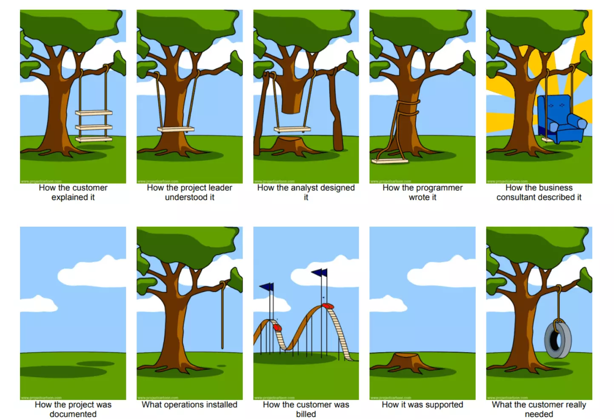

<!-- .slide: class="alternate" -->


# Implementing Domain-Driven Design in Django


---

## Outline

1. The OSIS project
2. The why and when for choosing DDD
3. Common tactical patterns in Python/Django
4. Our take on DDD usage

Notes:

- Code will be shown
- I hope to have some time for the questions (25mn max)

---

## Who am I?

> Sébastien Corbin (@SebCorbin)

- been doing Python/Django since 2016
- full-stack, previously PHP/Drupal, 10-year XP in web dev
- local meetup co-organizer, tutor

---

## Who I work for?

> Makina Corpus <https://makina-corpus.com/>

- small-sized agency (~50 persons) in Toulouse and Nantes, France
- Python (web business apps, GIS, data science & AI)
- PHP (web business apps)
- Front-end
- all open-source

---
<!-- .slide: class="alternate" -->

# The OSIS project

---

-  Université Catholique de Louvain *alias* UCL
-  Open Student Information System
- Long-term project: first release of OSIS on January 31, 2016
 
> <https://github.com/uclouvain>

Notes:
It's "almost" open-source, main project has recently been taken out of public

---

## OSIS Business

- Student admission (bachelor, master, doctorate, etc.)
- Student path management
- Course and exam catalogue and enrollment
- Tutor applications
- Assessments and score encoding
- Internships
- Partnerships with other universities (financing, agreements)
- ...

*We* were in charge of implementing partnerships, and recently remaking the student admission system

---

## Architecture

~ 35 000 students and ~ 6 000 staff members to handle

Security-oriented architecture

```text
				┌──────────────────────┐                  ┌────────────────────────┐
				│      Backoffice      │  API generated   │    Frontoffice         │
				├──────────────────────┤     in Python    ├────────────────────────┤
				│                      │                  │                        │
				│  Internal portal     │                  │  External portal       │
				│                      │◄────────────────►│                        │
				│                      │                  │                        │
				│ > Managers           │                  │ > Students             │
				│ > Administrators     │                  │ > Tutors               │
				│                      │                  │                        │
				└──────────────────────┘                  └────────────────────────┘
```

On the Django side:

- 65+ django apps
- ~250 models


Notes:
- 2 servers, 2 Django 
- the backoffice is only accessible through a VPN, for security reasons
- the public facing portal communicates through an API generated with openapi generator
- only stores basic data in database, historic decision, could be replaced by a framework-based frontend later

---
<!-- .slide: class="alternate" -->

# What is DDD, why and when?

---

> **Domain-Driven** ~~Development~~ **Design**
>
> A major software design approach, focusing on modelling software to match a domain according to input from that domain's experts. <small>(Source: Wikipedia)</small>

As a developer, you're **not** the expert.

It's an approach for conception, not a software recipe, nor a framework.  
It's language-agnostic.  
Theorized by Eric Evans.

---

## Business domain at the center

- As you're not the expert, you must speak the **same language** as domain's experts, have the same terms.
- If needed (because sometimes they're speaking a weird language), a **glossary** can be created
- Your code must reflect these terms
- If your domain is expressed in French, yes, your DDD code should be in French


Notes:
So I'll be showing some code that is in French (which I will translate as much as I can) but the important part is the approach, and every domain is different

---

## But why so much pain?

> Django is a model-driven (or data-driven ?) framework !

- Yes, but for **complex processes**, the code can look like spaghetti
- When your model changes, you **risk an alteration** of the process
- Sometimes you code things **you don't understand** (and you're translating it wrong)
- A model-driven architecture represent a developer's **way of thinking**, and teams can change over time
- **Code structure** represents the domain, it "could" almost be read by non-technical staff
- Highly testable (you know, unit testing **and** functional testing)
- Highly maintainable

---



---

## When to use DDD?

- Project must be maintained in the **long-term** (5 years +)
- Lots of business domains
- You have ~~time~~ **money** and software crafting experience


---

## When _not_ to use DDD?

- App is a simple **CRUD**
- Business is already answered by **third-party** (CMS, e-commerce, etc.)
- No maintenance needed over time, no evolution
- App is "too simple" or no complex business
- Short time-to-market or Proof-of-Concept
- Your dev team is too junior

### Can I use DDD in my existing project?

Yes

- you can separate and refactor small parts of your domain first
- you can design new parts of your domain apart from the existing code

> DDD has been introduced in OSIS 5 years after the first release

---

<!-- .slide: class="alternate" -->

# Common patterns

---

## Ubiquitous language


- Use the right terms across your domain
- Define them at the **beginning**, they must come from the business but they can be discussed
- Once stated, if needed, create a **glossary** to explain their meaning
- A term can have **another meaning in another context**

---

## Bounded contexts

> Separate your business into small parts, each one solving a problem.

- means that an object can have **different name in different contexts**
	- User is a *customer* in the *commerce* domain
	- User is an *account* in the *invoicing* domain
	- User is a *recipient* in the *shipping* domain
- in the code, bounds usually means namespace
- does not mean contexts cannot communicate, but data **must be translated** between
- data exposure can depend on context (even if close in storage)
  - payment mode is only needed in *invoice* domain
  - address could be different in *invoice* and *shipping* domains

---

## Shared kernel

> A shared kernel can be created for objects that are used everywhere

*Common examples : user info, addresses, notifications*

## Onion architecture

```text [|8|6|4|2]
										┌──────────────────────────┐
										│ UI / Presentation layer  │
										│ ┌──────────────────────┐ │
										│ │    Service layer     │ │
										│ │ ┌──────────────────┐ │ │
										│ │ │ Repository layer │ │ │
										│ │ │ ┌──────────────┐ │ │ │
										│ │ │ │ Domain layer │ │ │ │
										│ │ │ └──────────────┘ │ │ │
										│ │ └──────────────────┘ │ │
										│ └──────────────────────┘ │
										└──────────────────────────┘
```
This is OSIS' take, some DDD architectures use *hexagonal* or *clean* architecture

---

### An example of directory structure

```text [1|69|2,20,22|3,12|29,45|45-60|47-50|58-60|52|46,51|53-57|81-98|95-96|92-94]
ddd
├── admission (enrollment process)
│   ├── preparation
│   │   ├── builder
│   │   ├── domain
│   │   ├── dtos
│   │   ├── repository
│   │   ├── test
│   │   └── use_case
│   │       ├── read
│   │       └── write
│   └── validation
│       ├── builder
│       ├── domain
│       ├── dtos
│       ├── repository
│       └── use_case
│           ├── read
│           └── write
├── formation_continue (a continuing education process)
│   └── ...
└── doctorat (a doctoral process)
    ├── builder
    ├── domain
    │   ├── model
    │   ├── service
    │   └── validator
    ├── dtos
    ├── epreuve_confirmation
    │   ├── builder
    │   ├── domain
    │   │   ├── model
    │   │   └── service
    │   ├── dtos
    │   ├── repository
    │   ├── test
    │   │   ├── factory
    │   │   └── use_case
    │   │       ├── read
    │   │       └── write
    │   ├── use_case
    │   │   ├── read
    │   │   └── write
    │   └── validators
    ├── formation
    │   ├── builder
    │   ├── domain
    │   │   ├── model
    │   │   ├── service
    │   │   └── validator
    │   ├── dtos
    │   ├── repository
    │   ├── test
    │   │   ├── factory
    │   │   └── use_case
    │   │       ├── read
    │   │       └── write
    │   └── use_case
    │       ├── read
    │       └── write
    ├── repository
    ├── test
    │   ├── factory
    │   └── use_case
    │       └── read
    └── use_case
        ├── read
        └── write
infrastructure
├── admission
│   ├── preparation
│   │   ├── domain
│   │   │   └── service
│   │   │       └── in_memory
│   │   └── repository
│   │       └── in_memory
│   └── validation
│       └── repository
│           └── in_memory
├── formation_continue
└── doctorat
    ├── domain
    │   └── service
    │       └── in_memory
    ├── epreuve_confirmation
    │   ├── domain
    │   │   └── service
    │   │       └── in_memory
    │   └── repository
    │       └── in_memory
    ├── formation
    │   ├── domain
    │   │   └── service
    │   │       └── in_memory
    │   └── repository
    │       └── in_memory
    └── repository
        └── in_memory
```

Notes:

1. there are two main directories ddd and infrastructure
2. we have our main contexts
3. which can have sub contexts
4. Let's see what we have in a bounded context
5. We have the main components of our domain (we'll go further into the code later)
6. We have the use_case (also called application services)
7. Some useful classes to manipulate data
8. And unit tests
9. In the infrastructure, we map the same directory structure
10. only we add in-memory and django implementations for each context
11. as you can see some domain services could also need different implementations

---


## Vocabulary

- **Use case** : some action, a query (read) or command (write) made by someone
- **Repository** : your way to the data
- **DTO** : Data-Transfer-Object, a dumb data class used to I/O from context
- **Domain service** : useful when dealing with multiple or complex things
- **Validator** : prevents manipulating a wrong state in your domain

---

## Use cases

Also called "application services", basically a user story

Special technique : **Event storming**

Get everyone in the business around a table to state on what should the application do
(take this time to also establish the glossary)


---

**Event modeling**

Basically the same, but closer to the user interface


---

## A brief comment on Python

- Use python 3.7+ for **dataclasses**
- `attrs` is a nice library for default attribute factories, frozen and slotted classes
- **Using typing** make it easier, `mypy` (with `django-stubs`) is your friend after that
- **Avoid using any of Django** in `ddd` directory (apart maybe gettext_lazy, SimpleTestCase and timezone)

### Now some code !

---

### An example of an aggregate

- it's a root entity (could be a single model in Django, or multiple, or a part)
- it has an identity (usually PK, may be an uuid)
- it has a state (data attributes) and some behaviors (methods)
- that may contain complex data (through ValueObjects)
- some behavior can ensure its state is valid before modifying it
- it can be loaded and saved through a repository

```python [|1-3|7|9-11|13-25|28-31|]
@attr.dataclass(frozen=True, slots=True)
class EpreuveConfirmationIdentity(interface.EntityIdentity):
    uuid: str

@attr.dataclass(slots=True, hash=False, eq=False)
class EpreuveConfirmation(interface.RootEntity):
    entity_id: EpreuveConfirmationIdentity

    doctorat_id: DoctoratIdentity
    date_limite: datetime.date
    rapport_recherche: List[str] = attr.Factory(list)

    demande_prolongation: Optional['DemandeProlongation'] = None

    def faire_demande_prolongation(
        self,
        nouvelle_echeance: datetime.date,
        justification_succincte: str,
        lettre_justification: List[str],
    ):
        self.demande_prolongation = DemandeProlongation(
            nouvelle_echeance=nouvelle_echeance,
            justification_succincte=justification_succincte,
            lettre_justification=lettre_justification,
        )

    def verifier_pour_encodage_decision(self):
        EncodageDecisionValidatorList(
            date=self.date,
            proces_verbal_ca=self.proces_verbal_ca,
        ).validate()
        self.attestation_reussite = []


    def completer_par_promoteur(
        self,
        proces_verbal_ca: List[str],
        avis_renouvellement_mandat_recherche: List[str],
    ):
        self.proces_verbal_ca = proces_verbal_ca
        self.avis_renouvellement_mandat_recherche = avis_renouvellement_mandat_recherche

```
---

## An example of repository

- Based on an interface, swappable, can have an in-memory version for unit tests, or even a SQLAlchemy version to drop Django ORM
- It should have 3 default methods : `get`, `save` (update or create), and `delete`, but can have other methods (search, get_by_X)
- Can return an aggregate (or a collection of) or DTOs

```python [|4|19|31]
class IEpreuveConfirmationRepository(interface.AbstractRepository):
    @classmethod
    @abc.abstractmethod
    def get(cls, entity_id: 'EpreuveConfirmationIdentity') -> 'EpreuveConfirmation':
        raise NotImplementedError

    @classmethod
    @abc.abstractmethod
    def get_dto(cls, entity_id: 'EpreuveConfirmationIdentity') -> 'EpreuveConfirmationDTO':
        raise NotImplementedError

    @classmethod
    @abc.abstractmethod
    def save(cls, entity: 'EpreuveConfirmation') -> 'EpreuveConfirmationIdentity':  # type: ignore[override]
        raise NotImplementedError

    @classmethod
    def search(  # type: ignore[override]
        cls,
        entity_ids: Optional[List['EpreuveConfirmationIdentity']] = None,
        **kwargs,
    ) -> List[EpreuveConfirmation]:
        raise NotImplementedError

    @classmethod
    def delete(cls, entity_id: 'EpreuveConfirmationIdentity', **kwargs) -> None:  # type: ignore[override]
        raise NotImplementedError
```


Notes:

no booing please :)

---

### The Django implementation

Mapping your model(s) to the aggregate and ValueObject

```python [|5,9-24|43-57]
class EpreuveConfirmationRepository(IEpreuveConfirmationRepository):
    @classmethod
    def get(cls, entity_id: 'EpreuveConfirmationIdentity') -> 'EpreuveConfirmation':
        try:
            confirmation_paper = ConfirmationPaper.objects.select_related('admission').get(uuid=entity_id.uuid)
        except ConfirmationPaper.DoesNotExist:
            raise EpreuveConfirmationNonTrouveeException

        return EpreuveConfirmation(
            entity_id=EpreuveConfirmationIdentityBuilder.build_from_uuid(str(confirmation_paper.uuid)),
            doctorat_id=DoctoratIdentityBuilder.build_from_uuid(confirmation_paper.admission.uuid),
            date_limite=confirmation_paper.confirmation_deadline,
            date=confirmation_paper.confirmation_date,
            rapport_recherche=confirmation_paper.research_report,
            demande_prolongation=DemandeProlongation(
                nouvelle_echeance=confirmation_paper.extended_deadline,
                justification_succincte=confirmation_paper.brief_justification,
                lettre_justification=confirmation_paper.justification_letter,
                avis_cdd=confirmation_paper.cdd_opinion,
            )
            if confirmation_paper.extended_deadline
            else None,
            ....
        )
	
	...

    @classmethod
    def save(cls, entity: 'EpreuveConfirmation') -> 'EpreuveConfirmationIdentity':
        related_admission = DoctorateAdmission.objects.get(uuid=entity.doctorat_id.uuid)

        extended_deadline_params = (
            {
                'extended_deadline': entity.demande_prolongation.nouvelle_echeance,
                'cdd_opinion': entity.demande_prolongation.avis_cdd,
                'justification_letter': entity.demande_prolongation.lettre_justification,
                'brief_justification': entity.demande_prolongation.justification_succincte,
            }
            if entity.demande_prolongation
            else {}
        )

        ConfirmationPaper.objects.update_or_create(
            uuid=entity.entity_id.uuid,
            defaults={
                'admission': related_admission,
                'confirmation_date': entity.date,
                'confirmation_deadline': entity.date_limite,
                'research_report': entity.rapport_recherche,
                'supervisor_panel_report': entity.proces_verbal_ca,
                'supervisor_panel_report_canvas': entity.canevas_proces_verbal_ca,
                'research_mandate_renewal_opinion': entity.avis_renouvellement_mandat_recherche,
                'certificate_of_failure': entity.attestation_echec,
                'certificate_of_achievement': entity.attestation_reussite,
                **extended_deadline_params,
            },
        )

        return entity.entity_id
```

---

## An example of a use case

```python [|2|3-9|]
@attr.dataclass(frozen=True, slots=True)
class CompleterEpreuveConfirmationParPromoteurCommand(interface.CommandRequest):
    uuid: str

    proces_verbal_ca: List[str]
    avis_renouvellement_mandat_recherche: List[str]
```

```python [|2|3|5-7|9-13|15-18]
def completer_epreuve_confirmation_par_promoteur(
    cmd: 'CompleterEpreuveConfirmationParPromoteurCommand',
    epreuve_confirmation_repository: 'IEpreuveConfirmationRepository',
) -> DoctoratIdentity:
    # GIVEN
    epreuve_confirmation_id = EpreuveConfirmationIdentityBuilder.build_from_uuid(cmd.uuid)
    epreuve_confirmation = epreuve_confirmation_repository.get(epreuve_confirmation_id)

    # WHEN
    epreuve_confirmation.completer_par_promoteur(
        proces_verbal_ca=cmd.proces_verbal_ca,
        avis_renouvellement_mandat_recherche=cmd.avis_renouvellement_mandat_recherche,
    )

    # THEN
    epreuve_confirmation_repository.save(epreuve_confirmation)

    return epreuve_confirmation.doctorat_id
```

Notes:

1. we have a command, that sends data
2. our use case receive this command with repository interface (dependency injection)
3. we start by loading things, basically an initial state
4. we do some things on the state (validating it and modifying it)
5. we save that to our repository


---

## Mapping use cases in the message bus

A classic message bus with `invoke()` and `invoke_multiple()` methods with dependency injection  
2 versions: a Django implementation and an in-memory for unit testing

```python
class MessageBusCommands(AbstractMessageBusCommands):
	command_handlers: {
	    RecupererEpreuvesConfirmationQuery: partial(
	        recuperer_epreuves_confirmation,
	        epreuve_confirmation_repository=EpreuveConfirmationRepository(),
	        doctorat_repository=DoctoratRepository(),
	    ),
	    CompleterEpreuveConfirmationParPromoteurCommand: partial(
	        completer_epreuve_confirmation_par_promoteur,
	        epreuve_confirmation_repository=EpreuveConfirmationRepository(),
	    ),
	    ...
	}

```

---


## Using it in Django

```python [|10-12|14-19|7,21]
class SupervisedConfirmationAPIView(APIPermissionRequiredMixin, mixins.UpdateModelMixin, GenericAPIView):
    name = "supervised_confirmation"
    schema = PromoterConfirmationSchema()

    def put(self, request, *args, **kwargs):
        """Complete the confirmation paper related to a doctorate"""
        serializer = serializers.CompleteConfirmationPaperByPromoterCommandSerializer(data=request.data)
        serializer.is_valid(raise_exception=True)

        last_confirmation_paper = message_bus_instance.invoke(
            RecupererDerniereEpreuveConfirmationQuery(doctorat_uuid=kwargs.get('uuid')),
        )

        result = message_bus_instance.invoke(
            CompleterEpreuveConfirmationParPromoteurCommand(
                uuid=last_confirmation_paper.uuid,
                **serializer.validated_data,
            )
        )

        serializer = serializers.DoctorateIdentityDTOSerializer(instance=result)

        return Response(serializer.data, status=status.HTTP_200_OK)
```

NB: Command/Query and DTO dataclasses can be easily converted to serializers

---
<!-- .slide: class="alternate" -->

# Our take

---

## Pros
- Technical complexity is concentrated in the `ddd` directory, with classic python
- DRY
	- a use case could be re-used in multiple places in the UI
	- business validators too
	- optimize queries in the repository, model proxy and manage still have sense
- Premature optimization is avoided
- Your code is well-structured, easily readable (even by a non-technical person)
- Typing and type checking (F*** yeah!)
- Easier maintenance

---

## Cons
- You lose the sugar (Rapid Application Development) of Django
- Auto-scaffolding is out (or you must rework it)
- Some queries (especially across multiple aggregate/domains) become complex
- ORM is a bit trickier to optimize
- It takes more time, so more money

---

### That talk was a load of crap? You want the exact opposite ?

Have a look at the session "**Data-Oriented Django**", by Adam Johnson, just after the keynote (3pm)

---

# Thank you!

## Questions?

If not here, tweet me @SebCorbin
